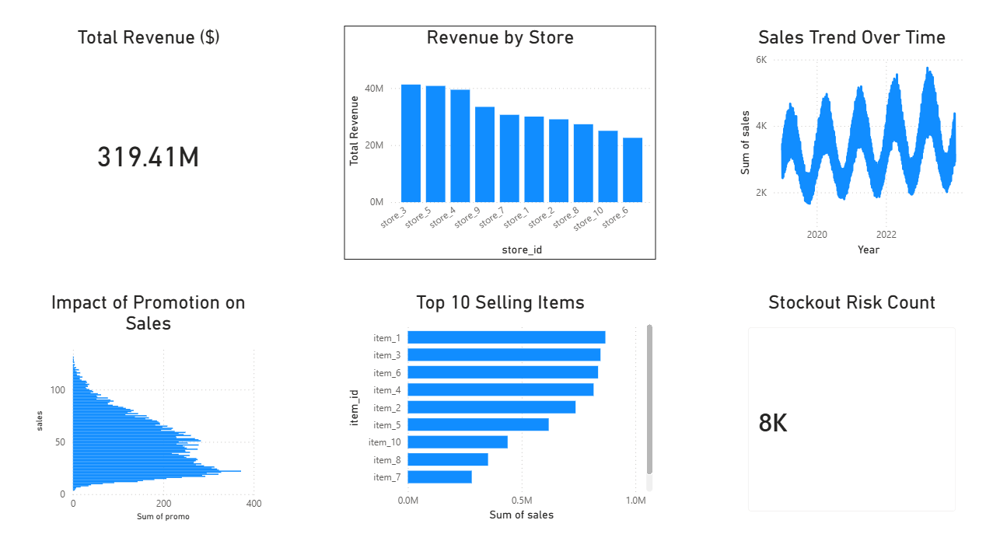

# Inventory Analytics and Demand Forecasting Project

## Project Overview

This project focuses on analyzing retail sales data, forecasting demand, and monitoring inventory performance using Python, SQL, and Power BI.

The goal is to help businesses:

* Predict future demand
* Monitor sales performance
* Detect stockout risks
* Optimize inventory levels
* Support data-driven decision making

The project integrates data processing, forecasting models, SQL analytics, and an interactive Power BI dashboard.

---

## Tech Stack

Python
Pandas
NumPy
Matplotlib
Scikit-learn
MySQL
Power BI

---

## Project Workflow

Data Collection
→ Data Cleaning
→ Database Storage
→ KPI Analysis
→ Demand Forecasting
→ Power BI Dashboard Visualization

---

## Dataset

The dataset contains retail sales transaction records including:

* Date
* Store ID
* Item ID
* Sales quantity
* Price
* Promotion indicator
* Weekday and month
* Forecasted demand
* Inventory level
* Stockout risk

---

## Project Structure

inventory-analytics-project/

dashboard/
  inventory_dashboard.pbix

data/
  retail_sales_data.csv
  cleaned_sales_data.csv
  kpi_sales_data.csv
  dashboard_screenshot.png

scripts/
  data_cleaning.ipynb
  forecasting.ipynb
  kpi_analysis.ipynb
  load_to_mysql.ipynb

sql/
  create_tables.sql

requirements.txt

---

## Key Features

Sales Trend Analysis

Revenue Analysis by Store

Promotion Impact Analysis

Top Selling Products Identification

Stockout Risk Detection

Demand Forecasting using Machine Learning

Interactive Power BI Dashboard

---

## Dashboard Preview

---

## SQL Database

The project uses a MySQL database named:

retail_sales_db

The main table:

sales_data

It stores daily sales transactions and supports analytical queries for business intelligence reporting.

---

## Key Business Metrics (KPIs)

Total Revenue

Revenue by Store

Sales Trend Over Time

Promotion Impact on Sales

Top Selling Items

Stockout Risk Count

---

## Machine Learning Model

The demand forecasting model predicts future sales based on:

Historical sales
Promotion activity
Seasonality
Store performance

The model helps:

Improve inventory planning
Reduce stockouts
Optimize supply chain decisions

---

## Installation

Install dependencies:

pip install -r requirements.txt

---

## How to Run the Project

Step 1 — Clean Data

Run:

scripts/data_cleaning.ipynb

Step 2 — Load Data to MySQL

Run:

scripts/load_to_mysql.ipynb

Step 3 — Perform KPI Analysis

Run:

scripts/kpi_analysis.ipynb

Step 4 — Run Forecasting Model

Run:

scripts/forecasting.ipynb

Step 5 — Open Dashboard

Open:

dashboard/inventory_dashboard.pbix

---

## Future Improvements

Real-time inventory monitoring

Automated demand forecasting

Cloud deployment

API integration

---

## Author

Abhinav Singhal
f